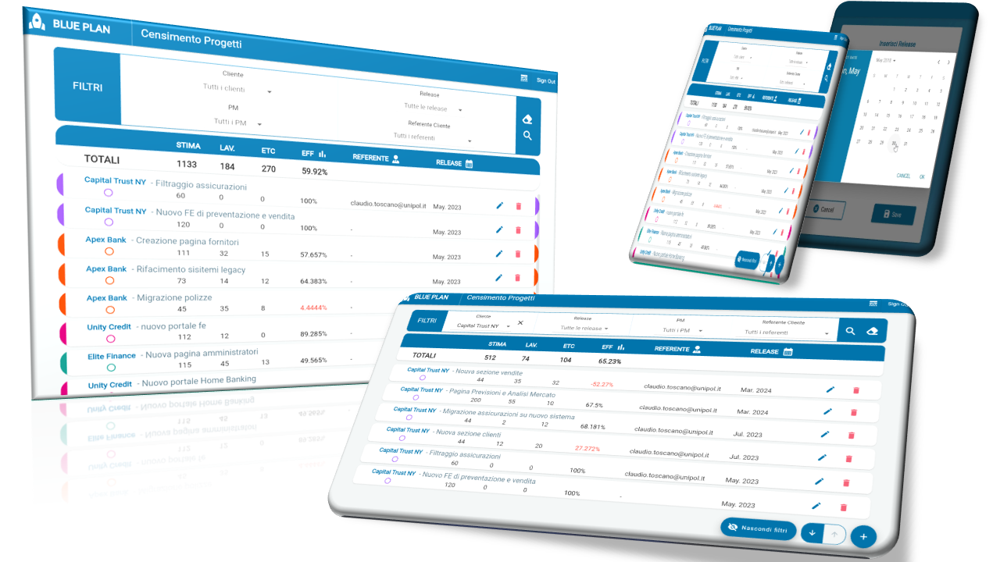
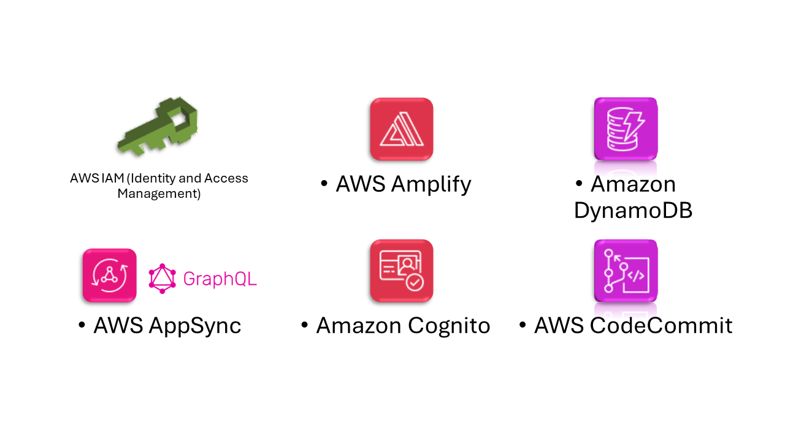

# WebApp Project Management with Flutter and AWS
This repository contains an application developed using the Flutter framework and integrated with a robust AWS cloud infrastructure. The application offers an intuitive and powerful experience for managing business projects and supporting decision-making. It combines innovative technologies and scalable cloud solutions.

## Architecture
<div style="display: flex;">
    
</div>

## Some UI
<div style="display: flex;">
    
    
</div>

## Technologies Used
- **Flutter**: Google's framework enabled cross-platform and responsive development.
- **AWS Amplify**: A suite of AWS cloud services that simplifies the development of scalable and secure apps, providing integration capabilities with the Amazon Web Services cloud structure.

## Flutter Architecture
- **Provider Pattern**: The application uses a state management system based on Provider, the most recommended state management package by Flutter's founders. Multiple providers allow complex and reliable management of the application's state.
- **MVVM (Model-View-ViewModel)**: The application adopts an MVVM architecture, separating business logic from user interface presentation for better maintainability and scalability.
- **Flutter Routing**: Flutter's routing system is used to enable smooth navigation between different screens of the application, ensuring an intuitive user experience.
- **Stateless Approach**: The application follows a stateless approach as much as possible to maximize performance and rebuild widgets only when strictly necessary, optimizing device resource usage.

### Code Structure
The application is organized following a modular and well-defined structure. Below are the most important folders:
- **screens**: Contains the project's pages (views). These files contain the "route" name to navigate between pages. For example, for the home:
    ```dart
    static const routeName = '/home';
    ```
    Additionally, they return a `Scaffold`, a widget that constitutes the main "container" of the user interface, equipped with `AppBar`, `body`, etc.
- **widgets**: Contains various created widgets: grids, lists, forms, buttons, and others. These widgets are defined only once and are used by screens or other widgets, sometimes multiple times.
- **providers**: Contains the provider classes used in the project. A Provider manages the application's state for a specific data model.
- **models**: Contains classes corresponding to the "entities" of the Data Model.
  
## AWS Cloud Infrastructure
The application makes use of AWS cloud services to provide advanced and scalable functionalities:
<div style="display: flex;">
    
</div>

- **AWS Amplify**: Used for orchestrating and managing cloud services, simplifying the development and deployment of the application.
- **Amazon Cognito**: For user authentication and authorization, ensuring secure access to the application's resources.
- **Amazon AppSync**: For creating scalable and flexible GraphQL APIs for accessing data from one or more sources, enabling efficient communication between the frontend and backend.
- **Amazon DynamoDB**: A fully managed NoSQL database service used for storing and managing application data reliably and scalably.
- **AWS CodeCommit**: For managing the application's source code.
