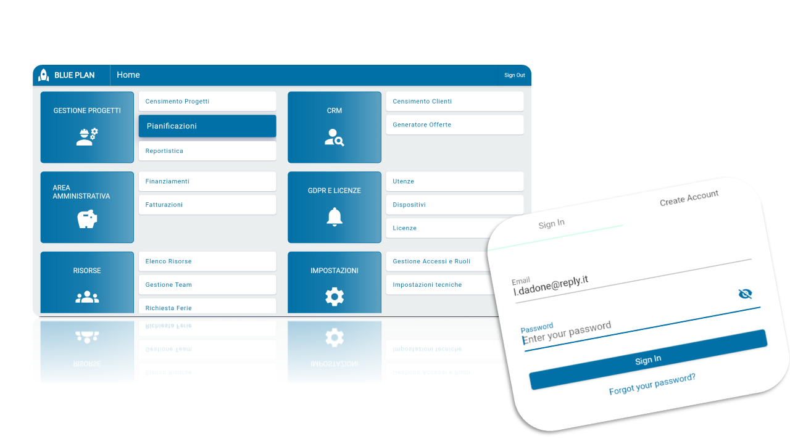

# WebApp Gestione Progetti con Flutter e AWS
Questo repository contiene un'applicazione sviluppata utilizzando il framework Flutter e integrata con una robusta infrastruttura cloud di AWS. L'applicazione offre un'esperienza intuitiva e potente per la gestione dei progetti aziendali e per il supporto alla presa di decisioni. L'applicazione combina tecnologie innovative e soluzioni cloud scalabili.

## Architettura
<div style="display: flex;">
    
</div>

## Alcune UI
<div style="display: flex;">
    
    
</div>

## Tecnologie Utilizzate
- **Flutter**: Il framework di Google, ha permesso uno sviluppo ***cross-platform*** e reattivo.
- **AWS Amplify**: Una suite di servizi cloud di AWS che semplifica lo sviluppo di app scalabili e sicure, fornendo funzionalità di integrazione con la struttura cloud di Amazon Web Services.

## Architettura in Flutter
- **Provider Pattern**: L'applicazione utilizza un sistema di gestione dello stato basato Provider, il package  di gestione dello stato più raccomandato dai fondatori di Flutter. Provider multipli consentono una gestione complessa e affidabile dello stato dell'applicazione.
- **MVVM (Model-View-ViewModel)**: L'applicazione adotta un'architettura MVVM, separando la logica di business dalla presentazione dell'interfaccia utente per una migliore manutenibilità e scalabilità.
- **Routing di Flutter**: Il sistema di routing di Flutter è utilizzato per consentire una navigazione fluida tra le diverse schermate dell'applicazione, garantendo un'esperienza utente intuitiva.
- **Approccio Stateless**: L'applicazione segue un approccio il più possibile statless per massimizzare le performance e ricostruire i widget solo quando strettamente necessario, ottimizzando l'utilizzo delle risorse del dispositivo.

### Struttura del Codice
L'applicazione è organizzata seguendo una struttura modulare e ben definita. Di seguito sono elencate le cartelle più importanti:
- **screens**: Contiene le pagine (views) del progetto. Questi file contengono il nome della “rotta” per poter navigare tra le pagine. Ad esempio, per la home:
    ```dart
    static const routeName = '/home';
    ```
    Inoltre, ritornano uno `Scaffold`, ovvero un widget che costituisce il "contenitore" principale dell'interfaccia utente, provvisto di `AppBar`, `body`, ecc.
- **widgets**: Contiene i vari widgets creati: griglie, liste, form, pulsanti e altri. Questi widget vengono definiti una sola volta e sono utilizzati dagli screens o da altri widget, anche più volte.
- **providers**: Contiene le classi provider utilizzate nel progetto. Un Provider gestisce lo stato dell'applicazione per uno specifico modello di dati.
- **models**: Contiene le classi corrispondenti alle “entità” del Data Model.
  
## Infrastruttura Cloud AWS
L'applicazione fa uso dei servizi cloud di AWS per fornire funzionalità avanzate e scalabili:
<div style="display: flex;">
    
</div>

- **AWS Amplify**: Utilizzato per l'orchestrazione e la gestione dei servizi cloud, semplificando lo sviluppo e il deployment dell'applicazione.
- **Amazon Cognito**: Per l'autenticazione e l'autorizzazione degli utenti, garantendo un accesso sicuro alle risorse dell'applicazione.
- **Amazon AppSync**: Per la creazione di API GraphQL scalabili e flessibili per l'accesso ai dati da una o più origini, consentendo una comunicazione efficiente tra il frontend e il backend.
- **Amazon DynamoDB**: Un servizio di database NoSQL completamente gestito, utilizzato per archiviare e gestire i dati dell'applicazione in modo affidabile e scalabile.
- **AWS CodeCommit**: Per la gestione del codice sorgente dell'applicazione.
